# Projeto NFT com NEXTJS
<h1 align="center">

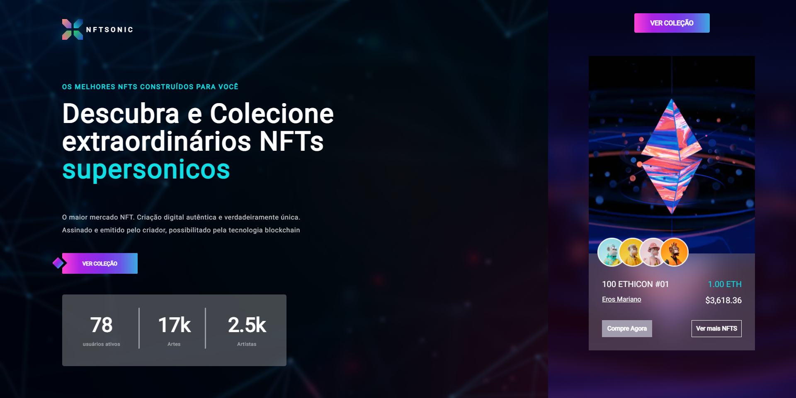

</h1>

<h4 align="center"> 🚀Desafio feito com o intuito de praticar a nova era da web 3.0, blockchain e NFT's🚀 </h4>

##  💻 Sobre o projeto

  
🔧O projeto foi desenvolvido com nextJs, sanity.io e thirdweb

  

##  🎨 Layout

</a>

<br>
</a>

###  Mobile

<p style="display: flex; align-items: flex-start; justify-content: center;">
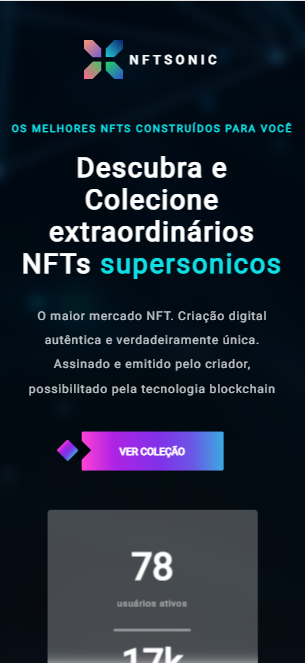
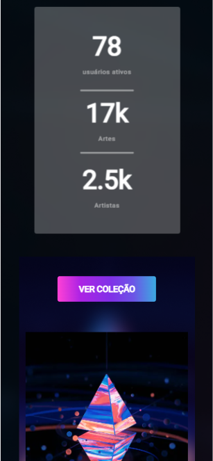
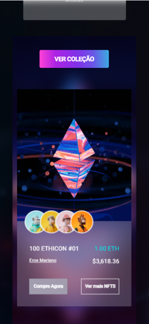
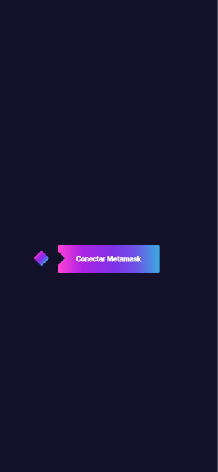
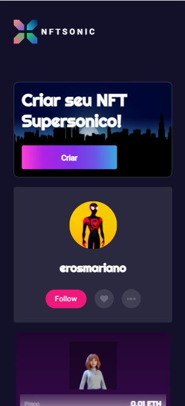

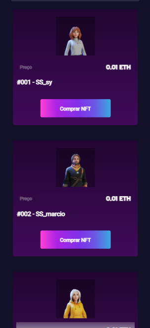
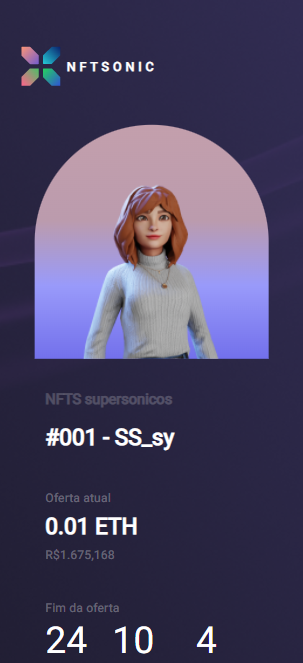
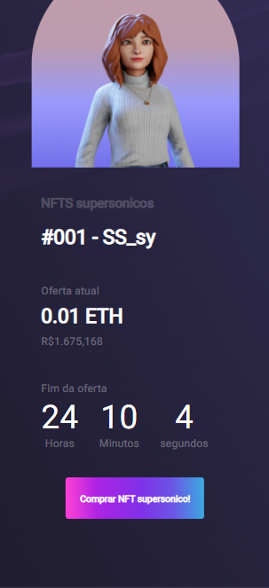

</p>

###  Web

  

<p align="center" style="display: flex; align-items: flex-start; justify-content: center;" style="margin: 20px">

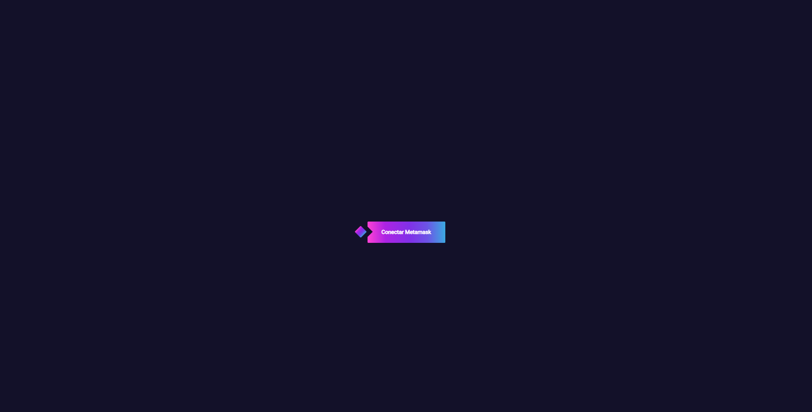
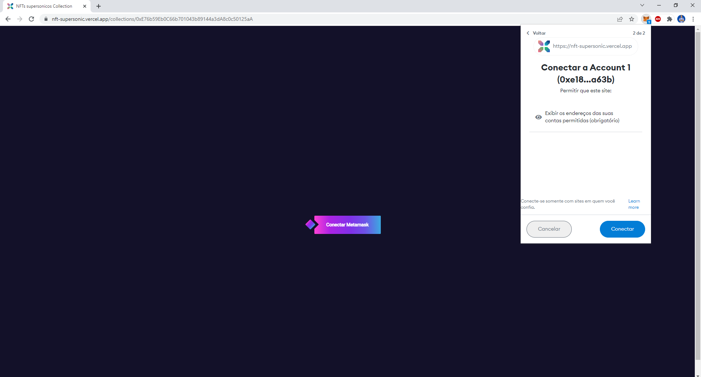
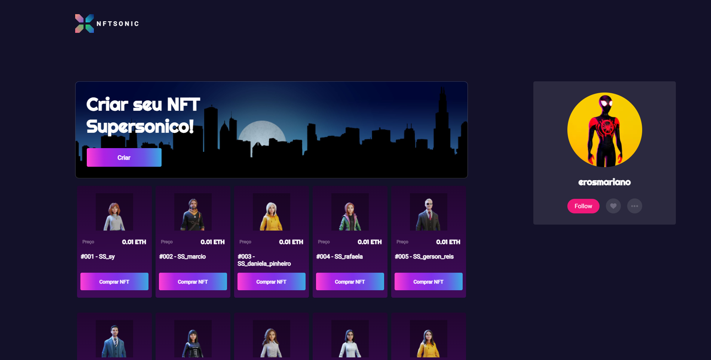
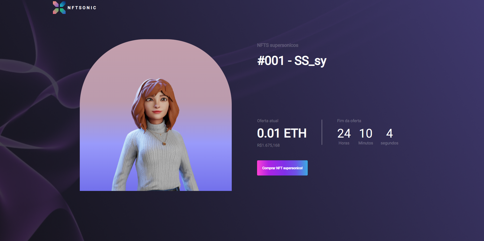

</p>


##  🛠 Tecnologias
  

As seguintes ferramentas foram usadas na construção do projeto:

  

- [NextJs](https://nextjs.org/)

- [Styled-components](https://getbootstrap.com/)

- [Thirdweb](https://thirdweb.com/)

- [Sanity.io](https://www.sanity.io/)

  
##  🚀 Como executar o projeto

  
<p>O primeiro passo é fazer o download do repositório para a sua máquina</p>
<p>Criar um projeto no sanity io e preencher os seguintes campos no .env.local</p>

```

NEXT_PUBLIC_PROJECT_ID_SANITY=

NEXT_PUBLIC_TOKEN_SANITY=

npm install -g @sanity/cli && sanity init

cd pasta_crida_sanity

yarn 
yarn start
```


<p>Para rodar o projeto do next</p>

```
yarn 
yarn start
```

Feito com 💚 por Eros Mariano 👋🏽 [Entre em contato!](https://www.linkedin.com/in/erosmariano/)
  
